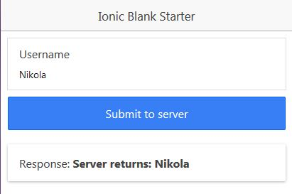

# IonicServerSave
The simplest example on how to POST data from Ionic to PHP server. Tutorial on how to create this step by step can be found [here](http://www.nikola-breznjak.com/blog/ionic/posting-data-from-ionic-app-to-php-server/).

The version for Ionic 2 of this project can be found [here](https://github.com/Hitman666/Ionic2ServerSendTest).

The version for Ionic 3 is [here](https://github.com/Hitman666/Ionic3ServerSendTest).
